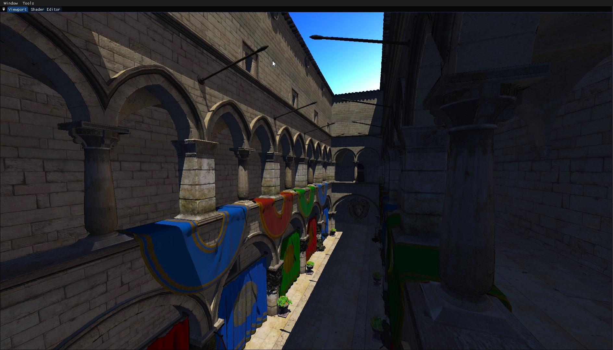

# so-so Engine

A personal rendering engine built for learning graphics programming.



### Features
- PBR materials with metallic/roughness workflow
- Image-based lighting (IBL) with irradiance and radiance maps
- HDR environment maps with equirectangular-to-cubemap conversion
- SPIR-V shader compilation and reflection
- Shadow mapping (WIP)
- Post-processing pipeline (WIP)
- Debug rendering (lines, AABBs, wireframe)
- ImGui editor overlay
- Profiler integration

### Tech
- C++23, OpenGL 4.6
- CMake build system (Linux + Windows)
- All dependencies vendored

## Build

### Linux

```bash
scripts/build.sh          # Build (Debug by default)
scripts/build.sh Release  # Build Release
scripts/run.sh            # Run
```

### Windows

```bash
cmake -B build -S .
cmake --build build --config Debug
```

Or open `CMakeLists.txt` directly in Visual Studio (File > Open > CMake...)

## Resources
- [The Cherno](https://www.youtube.com/@TheCherno)
- [Learn OpenGL](https://learnopengl.com/)
- [Real Time Rendering](https://www.realtimerendering.com/)
- [Game Engine Architecture - Jason Gregory](https://www.gameenginebook.com/)
